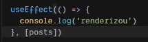
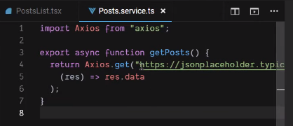

#### Vídeo 6

> Título: Você sabe MESMO como usar o hook useEffect?  
> Link: [Ver vídeo](https://www.youtube.com/watch?v=ndwM9djDRLg)

##### Onde é utilizado o useEffect?

- Componentes funcionais, assim como todos os outros Hooks

##### Sobre o useEffect

- O useEffect é executado toda vez em que o **componente** é renderizado, sendo assim, **toda chamada para o componente**, idependente do reload da página, **o hook é executado**

- O array de dependências do useEffect serve para: Toda vez que a variável que o hook está 'escutando' for modificada/alterada, ele será executado novamente

##### Exemplos:

 
Toda vez que a variável **posts** for alterada, o useEffect será executado, gerando a ação do *console.log('renderizou')*

 
 

Exemplo da utilização de **services**. Neste caso, a chamada da API é formalizada dentro do arquivo *Posts.service.ts*, com o método **getPosts()**. Posteriormente ela é chamada na função **fetchPosts()** e executada pelo useEffect toda vez que o componente é renderizado.