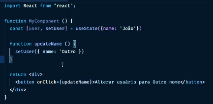
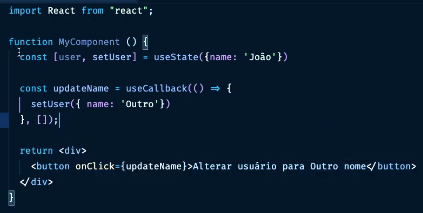

#### Vídeo 7

> Título: Explicando o hook useCallback ! Dicas avançadas de performance para React JS  
> Link: [Ver vídeo (Ctrl + Click)](https://www.youtube.com/watch?v=MPoVCO5na3Q)

##### Quando usar o useCallback?

- Recomenda-se utilizar esse hook apenas para códigos compostos de muita complexidade

##### Transcrição do vídeo

 
Toda vez em que o botão for clicado, o React fará uma **nova renderização** no componente, renderizando novamente tudo aquilo que há dentro do mesmo

 
Utilizando o useCallback, quando o componente for montado no primeiro render, o **React irá atribuir a função na memória**. 
Passando o **array de dependências vazio**, o React entende que ao fazer uma nova renderização, **não se deve fazer uma nova atribuição de memória**. Ao passar um **valor nas dependências do hook**, o React entende que a **função deve ser executada novamente** de acordo com a alteração do parâmetro passado.